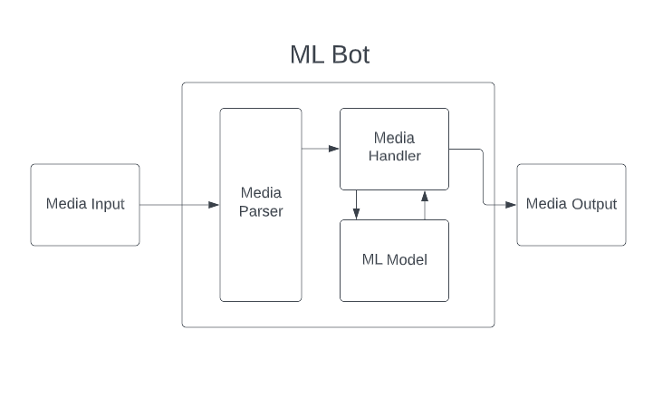

# Discord ML Sentiment Bot
course-project-group-38 created by GitHub Classroom


**Pitch**

Social media can be a toxic place full of rude and cynical people. Why
not have the ability to moderate and categorize every comment that goes
through a social media platform? Allow users to get feedback on whether
their comment is negative or positive so that they are more aware of
their social media presence and can work to become better people.

**Functionality**

1.  Users can see in real time whether the sentiment of their comment they made was positive or negative.

2.  The bot is able to read/process/react to messages sent by every user and categorize the comment by its sentiment

3.  The bot is able to interact with discord endpoint to be able to read/process discord messages sent by users

4.  The bot is deployed in some form whether it be on a personal device such as a raspberry pi or hosted through the cloud. Hosting on cloud would be more ideal as latency would be minimal. Hosting on a personal device would yield more latency if it is not connected via ethernet.

**Component**

-   Backend: 
    > The backend will be written in python3 and discord's native
    > bot framework. Everyone in our group is comfortable with python so
    > it makes sense to use python. A machine learning model will be
    > required to be able to categorize comments. Registration of a
    > discord bot will also be required and will give an API key for
    > validation used for development. We will test the backend using
    > functional tests, with metrics such as accuracy, recall, and F-1.

-   Frontend: 
    > The frontend is characterized by the user's interaction
    > with the bot. This is the stuff like configuring bot settings
    > through commands if needed as well as appropriately responding to
    > messages sent in a given platform. This is done in the Discord
    > app. We will test the frontend with acceptance tests.

-   Backend + Frontend Interaction: 
    > The Discord bot will receive commands from the Discord 
    > app. It will then be transferred to the backend
    > via the API key, where it is parsed and where it will be
    > inputted into the ML model. The output will then be sent back to
    > the Discord app in the form of a message. We will test their
    > interaction with integration testing and end-to-end testing.
    >   >For Slack, we can also program the bot to give reactions, however, it would be a different API
    >   >For Twitter and Instagram implementation, the bot would work by replying to user’s comments either stating that it is positive or negative. The bot would be called to classify a comment by tagging the bot’s username on either instagram or twitter, and this would signal the bot to read the comment.


> 

-   > If time permits, this bot can then be hosted on an IoT device such
    > as a raspberry pi or hosted on cloud such as Google Cloud
    > Platform/Amazon Web Services. It can then be expanded to other
    > social media platforms such as twitter/slack/instagram, although
    > bot interactions would have to be slightly different in order to
    > interact with these platforms as other platforms don't have
    > reaction features like discord.

**Weekly Schedule**

1.  Gather training & test data, clean data & ensure it is categorized correctly

2.  Create and train a model to classify comments

3.  Strive for 90%+ success rate on categorizing comments as either positive or negative, adjust parameters accordingly

4.  Create a layout in the backend to organize the model and create python framework for starter code

5.  Create the discord bot (register and configure the bot with the server)

6.  Connect discord bot to backend model & ensure proper functionality

7.  Possibly expand ways of interacting with bot, such as being able to link and instagram/twitter/slack account & evaluating messages there

8.  End-to-end testing and fixing as needed

**Risks**

1.  > We may encounter issues when obtaining training data for the model,
    > as we will need data that is categorized either by us or open
    > source training data that can be used to train our machine
    > learning model. This can delay the deployment of the model since
    > if we don't find good quality pre-categorized data, we would need
    > to individually categorize the data into the positive & negative
    > categories.

2.  > It may be an obstacle to deploy the bot in the cloud if chosen since
    > an environment will be required that is the same as the testing
    > environment which requires some additional configuration. This may
    > set back the possibility of expanding the bot to different
    > platforms, like instagram/twitter etc.

3.  > We may run into issues with getting the desired accuracy for our
    > model, this could set back the testing of the bot in its intended
    > environment as we would not yet be able to use the model to
    > provide live reactions to the sentiment of the comments users
    > make.

4.  > If the extra platforms are to be implemented and get all of these
    > platforms to interact with the ML model, there may be some
    > difficulty in running on all of these platforms simultaneously.

**Teamwork**

We plan on using github for standard version control throughout the
project, as well as weekly meetings to discuss project progression.
Primary means of communication will be through discord which at the time
of writing the proposal is already being used. Due to us having two
different OS (Windows and Mac), we can reduce friction and avoid running
into code malfunctioning by Windows users using WSL, specifically the
Ubuntu-22.04 distribution. Our primary IDE will be Visual Studio Code to
ensure we have the same coding environment and the proper extensions to
work remotely. To divide up work, weekly meetings will be held to
discuss progress as well as divide up work. Dividing up the work will
also largely depend on the experience each team member has. This will
ensure that we don\'t waste any time as we will take into account how
much a team member already knows and how much they have to learn. Each
meeting will also go over any GitHub merge requests that were generated
over the past week and finally, we\'ll go over what we want to
accomplish for the upcoming week.

**Continuous Integration**

To test the sentiment analysis feature, we can use various metrics such
as accuracy, recall, F-1 score, TP (true positive), and FP (false
positive). To test the discord bot, we will use integration tests,
functional tests, end-to-end tests, and acceptance tests. Test coverage
will be computed by the number of lines of code being tested divided by
the total number of lines. We will use the Python PEP 8 style guide for
both our ML model code and our Discord bot code:

[[https://peps.python.org/pep-0008/]{.ul}](https://peps.python.org/pep-0008/).

New branches will be opened when new features are planned; in our case,
that might be new commands for the Discord bot or updates to the ML
model. Whenever there is a merge request, all members will meet to
discuss whether to approve or deny the request.
test 

**Datasets** 

For building and training our model, we have pulled, compiled & organized data from the following datasets:

https://www.kaggle.com/datasets/jp797498e/twitter-entity-sentiment-analysis
https://www.kaggle.com/datasets/cosmos98/twitter-and-reddit-sentimental-analysis-dataset

**Team Member Roles**

Yash, Sumeet and Afif worked on the ML model training. Afif worked on the media handler. Michael worked on the frontend Discord bot (media parser) and its interactions with the ML model.

**Model .pkl File**

The model's pickle file was too large to store in GitHub, so here is a link to it in Google Drive: https://drive.google.com/file/d/1jdI6M3uzVeugvzk4R7jPBgTpvJzF0xsM/view?usp=sharing

This file should be put in the discord_bot folder. The command to run the bot is
```
python bot.py
```
with Python version 3.10.


**Requirements:**
Run the following to install all requirements necessary to run the bot.

        python -m pip install --upgrade pip
        pip install pylint
        pip install discord.py==1.6.0
        pip install pytest-cov
        pip install nltk
        pip install dpytest
        python3 -m nltk.downloader popular
        pip install PyNaCl
        pip install pytest-asyncio==0.19.0
        pip install -U scikit-learn
        pip install pandas
